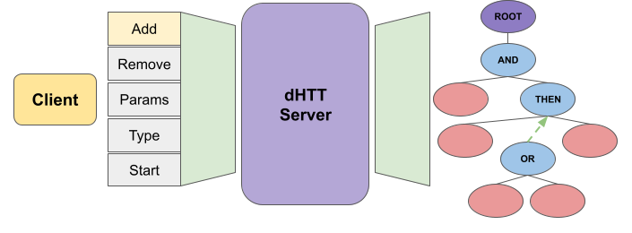

# dhtt_base

## Overview

This is the main repository for dynamic Hierarchical Task Trees (dHTTs) which are a hierarchical tree based task representation. The purpose of this is to offer an architecture for behavior-based control of a robot.

### License

TODO

**Authors: Tyler Becker 
Affiliation: [Robotics Research Lab: University of Nevada, Reno](https://rrl.cse.unr.edu/en/) 
Maintainer: Tyler Becker, tbecker@unr.edu**

This package has been tested under [ROS2] Foxy on Ubuntu 20.04.
This is research code, expect that it changes often and any fitness for a particular purpose is disclaimed.

### Publications

If you use this work in an academic context, please cite the following publication(s):

        @unpublished{beckerdhtt,
		    author = {Becker, Tyler J and Peterson, William and Schmidt-Wolf, Melanie and Feil-Seifer, David and Nicolescu, Monica},
		    title = {Dynamic Hierarchical Task Trees: A Representation for Tasks with Changing Requirements},
		    note = {submitted for publication},
		    year={2024}
		}

### Building from Source

#### Dependencies

- [Robot Operating System 2 (ROS2) Minimum Version Foxy](https://docs.ros.org/en/foxy/index.html)
- [Yaml-cpp]

#### Building

To build from source, clone the latest version from this repository into your catkin workspace and compile the package using

	cd catkin_workspace/src
	git clone https://github.com/tylerjohnbecker/dhtt_base.git
	cd ../
	colcon build --packages-select dhtt dhtt_msgs dhtt_plugins

### Unit Tests

Run the unit tests by first starting the dhtt main server application with:

	ros2 run dhtt start_server

Then in a new terminal run 

	colcon test --packages-select dhtt --event-handlers console_cohesion+

All tests are stored in the tests folder of the dhtt package.

## Usage

Describe the quickest way to run this software, for example:

Run the main node with

	ros2 run dhtt start_server

This server can then be interacted with through the exposed services that are described below.

In general, the server should be started. Nodes and subtrees will then be added from the modify_service. Then, the tree can be started with the control_service. 

## Description files

Subtrees that can be added through the modify_service are described in .yaml files. Examples are shown in [/dhtt/sample_tasks](/dhtt/sample_tasks).

The structure of the tree descriptions should be at least the following:

	# a list of all the nodes in this file by name
	NodeList:
		- Node1
		- Node2
	# each nodes description
	Node:
		# example task node description
		Node1:
			type: 2 # type integers are described in [/dhtt_msgs/msg/Node.msg](/dhtt_msgs/msg/Node.msg).
			behavior_type: "dhtt_plugins::ThenBehavior" # must refer to a NodeType plugin.
			robot: 0 # in the case of multiple robots
			parent: 'NONE' # if the parent is None than this node is the root of the subtree
			params: [] # node specific parameters go here as a list of strings with the format "key: value"
		Node2:
			type: 4
			behavior_type: "dhtt_plugins::MoveBehavior"
			robot: 0
			parent: 'Node1'
			params: ['dest: location_1'] # these are always just specific to the parameters of the node

## Launch files

N/A

## Nodes

### dHTT_server

Main server for interaction with the client. Contains helpful services that facilitate safely making modifications to the tree.

#### Subscribed Topics

* **`/status`** ([dhtt_msgs/msg/Node])

	A catch all topic that all Nodes in the tree use to report status changes to the server.

#### Published Topics

* **`/root_status`** ([dhtt_msgs/msg/NodeStatus])

	External topic to specifically report the status of the root node for monitoring the completion status of the tree as a whole. Listening here prevents the needs for filtering out other nodes from the `/status` topic.

#### Services

* **`/control_service`** ([dhtt_msgs/srv/ControlRequest])

	Performs any control requests for the server such as: starting/stopping execution, saving the current tree to a file, and resetting the tree.

* **`/fetch_service`** ([dhtt_msgs/srv/FetchRequest])

	Returns information about the current tree. This service can specifically search by type, name, etc.

* **`/history_service`** ([dhtt_msgs/srv/HistoryRequest])

	Returns information about the order in which nodes have been executed by the tree. Useful for testing and also for following the activation of each node.

* **`/modify_service`** ([dhtt_msgs/srv/ModifyRequest])

	Handles all modification type requests for the tree. This includes adding/removing nodes, updating parameters of nodes, and changing node types (mutation). These changes can be made either before or during runtime.

#### Parameters

N/A

## Documentation

Documentation for this project is generated by using [Doxygen](https://doxygen.nl/). To generate the documentation locally just run the following in the root directory of the project:

	doxygen config

Documentation is also hosted through github-pages here: [docs](https://tylerjohnbecker.github.io/dhtt_base/html/index.html)

